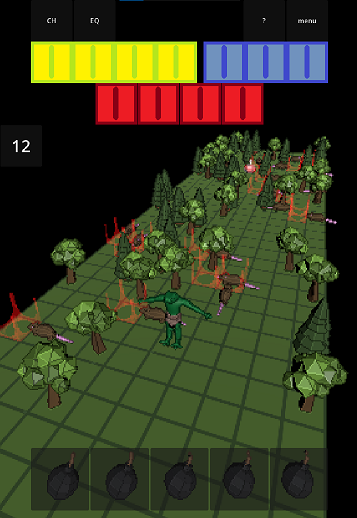
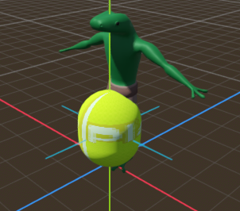
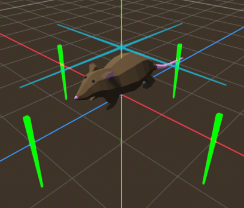
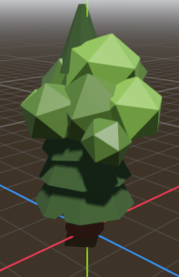
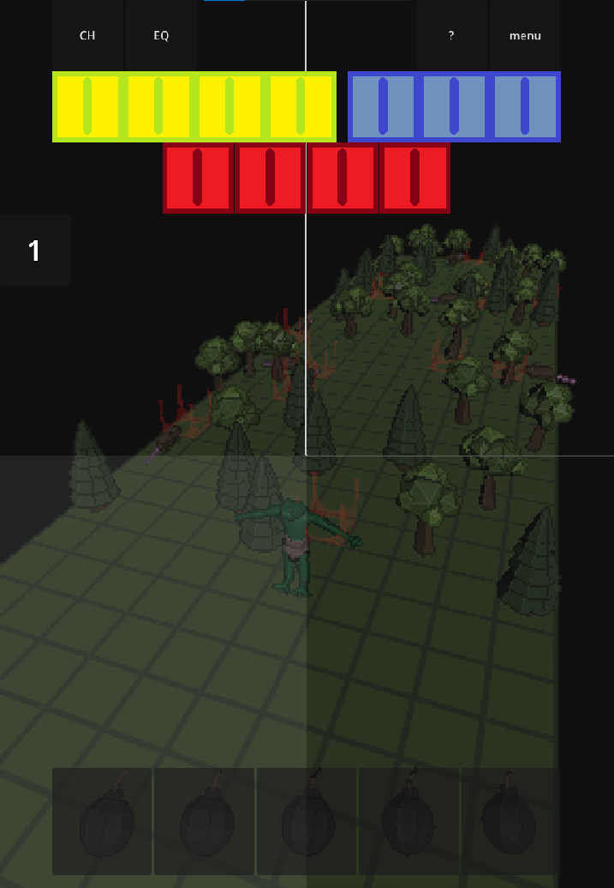

# Overview

A game inspired by the runner genre and "pixel dungeon".

There is a lack of organization, so everything is quite raw and I honestly don't want to clean the code and files of unnecessary things.

## Requirements

Godot.

## Usage

Import whole folder to a Godot, or download .apk form APK folder on your mobile to open it.

# Comments

## Scripts

All writen code in GDscript is in scripts file and there is shader in C#.

## Nodes

As you know in Godot everything is a node.

So I prepared some nodes like:

- player

There are two models of player in game only frog is visible.
For egg were made animations of rolling to easily change them to frog animations in the code later but I didn't animate the frog.
Visible rays are for collision detection.

- enemy

Enemy own more rays to detect flor if he can step on it.
Rats have very simple AI that randomly selects the direction in which they will go.

- modules

There is a lot of types of modules f.x. invisible walls, walls like on screen, flors, 3Dhitmarks etc. Those are just bricks from which the world is generated.
Changing the appearance of the module is done by turning on one of the skins.

- UI

The control is based on buttons in the UI, thanks to them you can move in four directions, or use items from the inventory, or press the menu. Pressing the equipment (bomb) turns off the UI while using the item so that you can mark the field on the board. Animation of bomb is made by generate path between bomb and marked module. The UI also has a working counter.
Additionally, the in-game menu has three options depending on the game state: resume, retry, exit, or revive, retry, exit

- Scens
Main two scens are main.tscn where the game generate whole world and menu.tscn from which you can start the game.

- World generator
World is generated inside of GridMap.gd script.
It generates bands that limit the player, modules on the board, and ensures that there is no possibility of a dead end.

