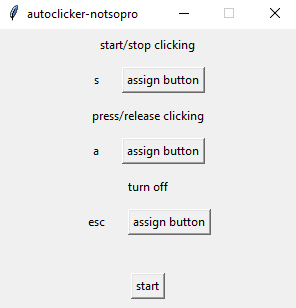
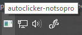
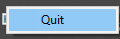

# Overview

LMB autoclicker with menu to assign keys.

Clicking thread is visible on windows bar.

## Requires

infi.systray>=0.1.12

pynput>=1.7.6

## Comments

When turning on the application, we are greeted by a menu, where we can define controls and the tray icon appears.

After clicking the start button, the application window hides, leaving only the tray icon and the user can turn the clicking action on, hold down the previously defined button to click only when it's held, or you can exit the application through the assigned button or through the icon tray.

