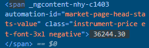
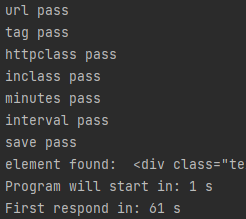
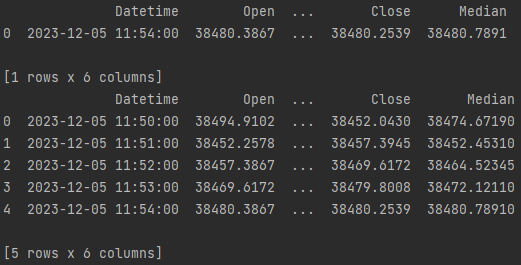

# Overview

This project scrapes real-time data, using beatifulsoup4 with selenium. Scraped data is saved in .csv file with candlestick pattern that can be use to real-time analysis bot.

## Introduction

There are many websites that provide real-time price. Depending on the page, the intervals between refreshing prices vary. It may be several times per second or once every 5 minutes. The website may also have a delay in transmitting actual data from a few minutes to even hours. Scraper allows you to collect data at intervals of no less than a second and not bigger than 60 seconds and packs it into packets in candle format every minute.

## Requirements

Choose your website, the page must refresh the data in real-time and not be protected against scraping.
e.g. finance.yahoo.com refresh data time to time, but class changes name every time when you open website. You can try to scrape it by using full xpath but you have to write the code yourself.
The code's limitation is also the format of writing numbers, sometimes values above a thousand are written with a space between hundreds and a thousand with the format e.g. "41&nbsp;763.15", this limit is due to the primitiveness of the code. Other decimal separators like comma, dot or apostrophe are supported.

### Required packages:
- beatifulsoup4
- selenium
- lxml (should be a part of bf4 if not install it manually)

## Usage

At choosen website inspect element with price, search current element in DevTool, if it's dynamically changing real-time data you can see changing white values as on fig.

Here class name changes every time when website opens so it can't be used in code.

Simply pass into the function as string url, tag, class name, class value, for how many minutes (>1), interval (60-1 [s]) and name or False if you don't want to save scraped data. The program will inform you if all values are correct, what element was found and when program will start (return file.csv every full minute) as on fig.

Program prints to the terminal last created candle, and saved DataFrame.

## Comments

- Sometimes selenium could have problem with finding current element even if all inputs are correct.
- Code must be adapted if we want to check the data, e.g. once every 5 minutes.
- Durring long time use, selenium chrome may stop refreshing data.

## Usage examples

At the end of the code you can find tree working input examples.

